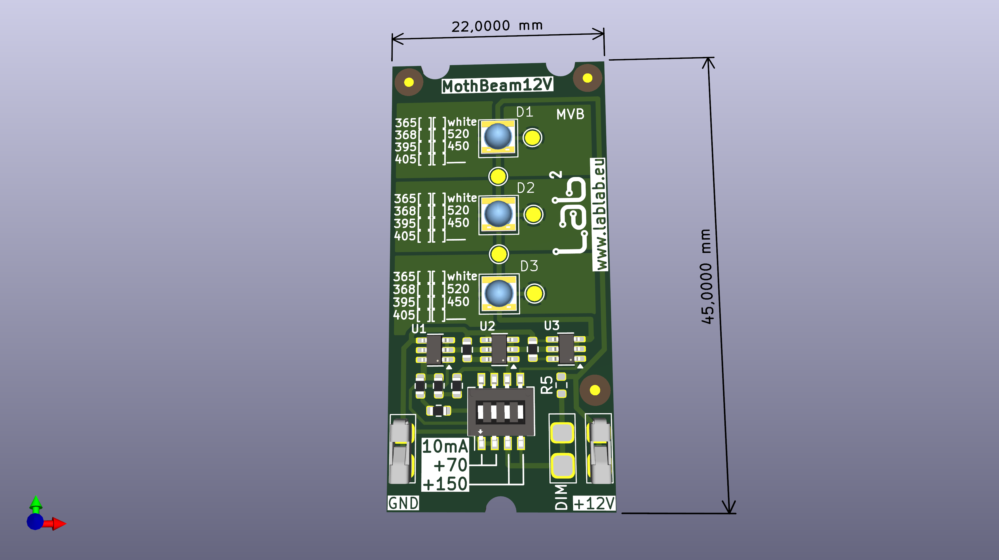

# mothbeam12V
A version of the MothBeam optimized for 12V operation. Select the LEDs according to your needs and according to the part numbers shown in the schematics. It is designed for a
IMS substrate PCB.

This project is CERN-OHL-W-2.0 open source hardware. It is has now officially been certified as open source hardware by the Open Source Hardware Association with UUID DE000156.

